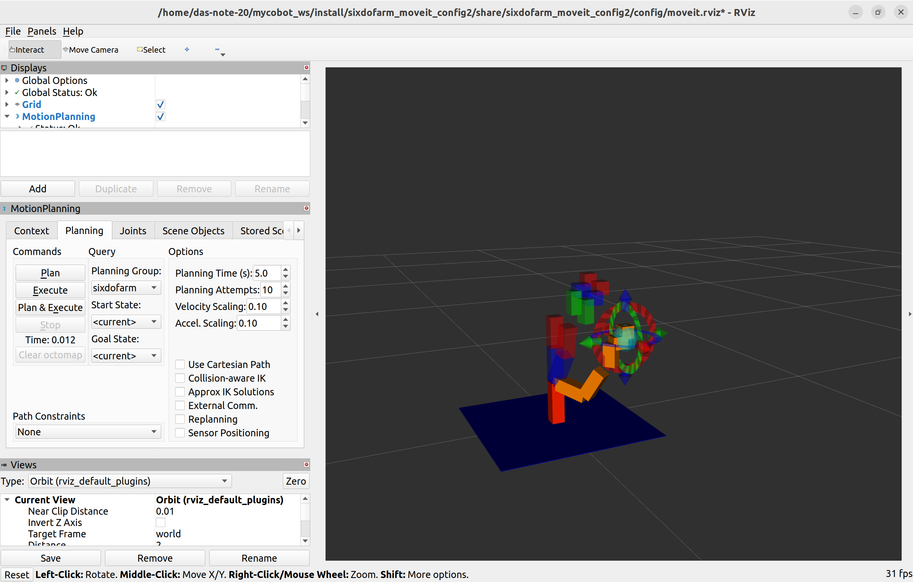

# sixdofarm_moveit_config2
Ubuntu 22.04
ROS2 Humble

参考にしているロボット
https://shop.elephantrobotics.com/products/mycobot-pi-worlds-smallest-and-lightest-six-axis-collaborative-robot

## Installation

### Build from source

```sh
# download
mkdir -p ~/mycobot_ws/src
cd ~/mycobot_ws/src
git clone https://github.com/danbo-rusenki/sixdofarm_moveit_config2.git

# build
cd ~/mycobot_ws
colcon build --symlink-install

```

## Quick Start
```sh
source ~/mycobot_ws/install/setup.bash
ros2 launch sixdofarm_moveit_config2 demo.launch.py 
```
rviz2が起動したら，手先を適当な位置まで動かし，左側の`MotionPlanning`タブの`Plan & Execute`を押します．

<p align="center">

</p>
